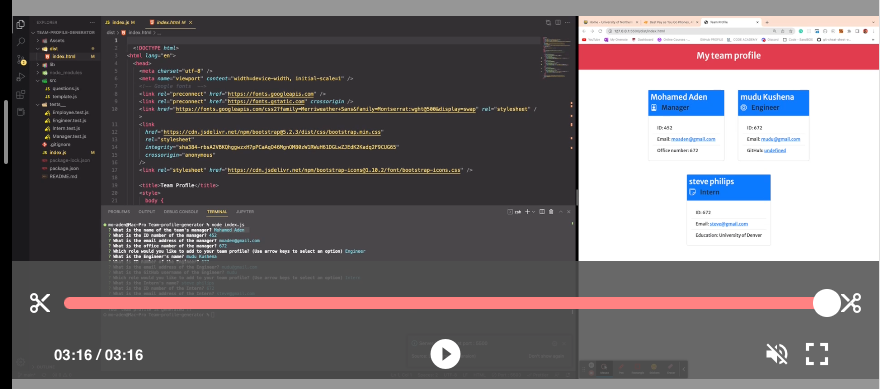

# Team-profile-generator

Following the user story below, I created this application for any manager to create a team profile very easily.

```md
AS A manager
I WANT to generate a webpage that displays my team's basic info
SO THAT I have quick access to their emails and GitHub profiles
```

The application has the following directory structures for easy understanding of what's in every folder.

```md
.
├── **tests**/ //jest tests
│ ├── Employee.test.js
│ ├── Engineer.test.js
│ ├── Intern.test.js
│ └── Manager.test.js
├── dist/ // rendered output (HTML) and CSS style sheet  
├── lib/ // classes
├── src/ // template and questions helper code
├── .gitignore // indicates which folders and files Git should ignore
├── index.js // runs the application
└── package.json
```

#### Watch the video below to see how the app works.

[](https://drive.google.com/file/d/1cS7IJNE66RUvacv8MtG0y42EUNVFcd8C/view "Demo Video")
